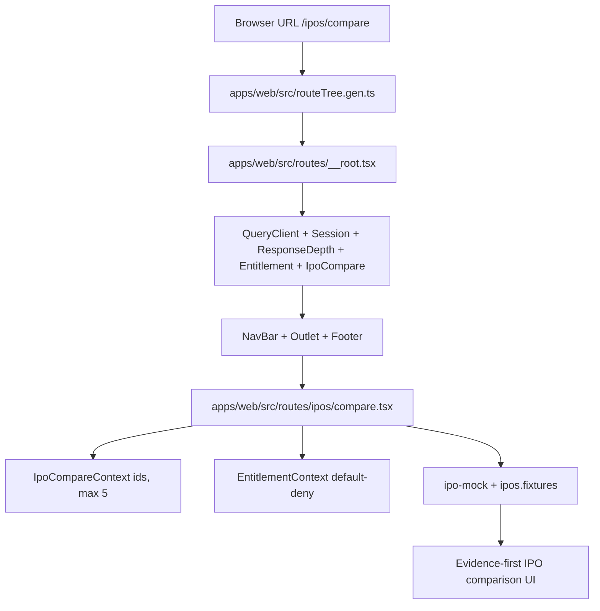

# Root Web Route Boundary Snapshot

> Status: resolved architecture queue follow-up for `docs/architecture/requests/root.md`
> Captured: 2026-06-25
> Scope: AiphaBee web root route shell and IPO workbench route expansion

## P1 Map

The affected boundary is the web application's root TanStack Router shell under `apps/web/src/routes/`, not the worker, data-ingest, or database runtime. The root route owns document metadata, global CSS/font links, the root app shell, shared client providers, top navigation, footer, and generated route registration.

Authoritative files:

- `apps/web/src/routes/__root.tsx`: root document, `QueryClientProvider`, `SessionProvider`, `ResponseDepthProvider`, `EntitlementProvider`, `IpoCompareProvider`, `NavBar`, `Outlet`, and `Footer`.
- `apps/web/src/routeTree.gen.ts`: generated TanStack route registry.
- `apps/web/src/components/NavBar.tsx`: top-level navigation and active route state.
- `apps/web/src/routes/index.tsx`: home entry and prompt-to-research navigation.
- `apps/web/src/routes/ipos/index.tsx`, `apps/web/src/routes/ipos/$ipoId.tsx`, `apps/web/src/routes/ipos/calendar.tsx`, `apps/web/src/routes/ipos/compare.tsx`: IPO workbench routes mounted under the same root shell.
- `apps/web/src/lib/context/EntitlementContext.tsx`: local default-deny field authorization demo state.
- `apps/web/src/lib/context/IpoCompareContext.tsx`: local IPO compare basket state.
- `apps/web/src/data/ipos.fixtures.ts` and `apps/web/src/lib/api/ipo-mock.ts`: mock-first IPO data source for the current workbench surface.

Current top-level route set includes `/`, `/dashboard`, `/ask`, `/ask/$runId`, `/stock`, `/stock/$instrumentId`, `/screen`, `/compare`, `/watchlist`, `/documents`, `/library`, `/mcp`, `/account`, `/ipos`, `/ipos/$ipoId`, `/ipos/calendar`, and `/ipos/compare`.

The capability registry is currently empty, so these routes remain under the root contract. A future functional-block contract can split IPO workbench ownership once the surface stops being a root-mounted preview and has durable capability ownership, local AGENTS/CLAUDE contracts, and focused verification commands.

Out of scope:

- Worker API route ownership.
- Live IPO/HKEX ingest execution.
- Supabase schema ownership beyond the route-facing entitlement and evidence assumptions.
- Human-rendered architecture diagram HTML. The Mermaid block below is the semantic source.

## P2 Trace

Concrete route path: user opens `/ipos/compare`.

1. `apps/web/src/routeTree.gen.ts` maps `/ipos/compare` to `apps/web/src/routes/ipos/compare.tsx`.
2. `apps/web/src/routes/__root.tsx` renders `RootDocument`, loads `aiphabee.css`, sets the pre-paint theme script, and mounts the route outlet inside the root shell.
3. Root providers wrap the outlet in this order: `QueryClientProvider` -> `SessionProvider` -> `ResponseDepthProvider` -> `EntitlementProvider` -> `IpoCompareProvider`.
4. `NavBar` uses TanStack router state to mark the active top-level route and to route icon actions to `/stock` and `/account`.
5. IPO compare state is read from `IpoCompareContext`. The basket is shared with `/ipos` row toggles and capped at five IDs.
6. Sensitive IPO fields render through the entitlement context. The default plan is `free`, so premium and enterprise fields remain default-deny until the local plan state authorizes them.
7. IPO data comes from fixture-backed mock APIs, not the worker. The route renders evidence/data-version chips and demand signals as descriptive research metadata, not investment advice.

Error and exceptional paths:

- Missing IPO compare IDs resolve to the route's empty/fixture fallback state rather than a network error.
- Unauthorized sensitive fields stay locked in the UI; the field value is not exposed by the component.
- Generated route mismatches are caught by TanStack type/build checks because `routeTree.gen.ts` is generated from the file route tree.

## P3 Decision

The current design keeps cross-route shell state at the root because the IPO workbench is still a root-mounted Gate-0 preview surface. That preserves three invariants:

- Navigation, theme, session, response-depth, entitlement, and compare basket state survive route changes.
- Sensitive vendor-derived fields are default-deny at the view boundary.
- Research surfaces describe evidence and demand signals without crossing into investment-advice copy.

The tradeoff is that root now knows about an IPO-specific compare and entitlement provider. That is acceptable while the capability registry has no IPO-specific contract and the workbench is preview-only. At 10x route count, the first thing to fail would be root-shell coupling: providers and nav would accumulate capability-specific state and make route-level verification too broad. The next split should be a functional-block contract for IPO workbench only when it has stable live data ownership, contract files, and focused tests.

## Route Boundary Diagram

## Verification Surface

- `bash scripts/architecture-queue.sh status --format json`
- `bash scripts/architecture-queue.sh reindex --check`
- `bash scripts/architecture-queue.sh check`
- `npx -y npm@11.12.1 run check`
- `npx -y npm@11.12.1 run typecheck --workspaces --if-present`
