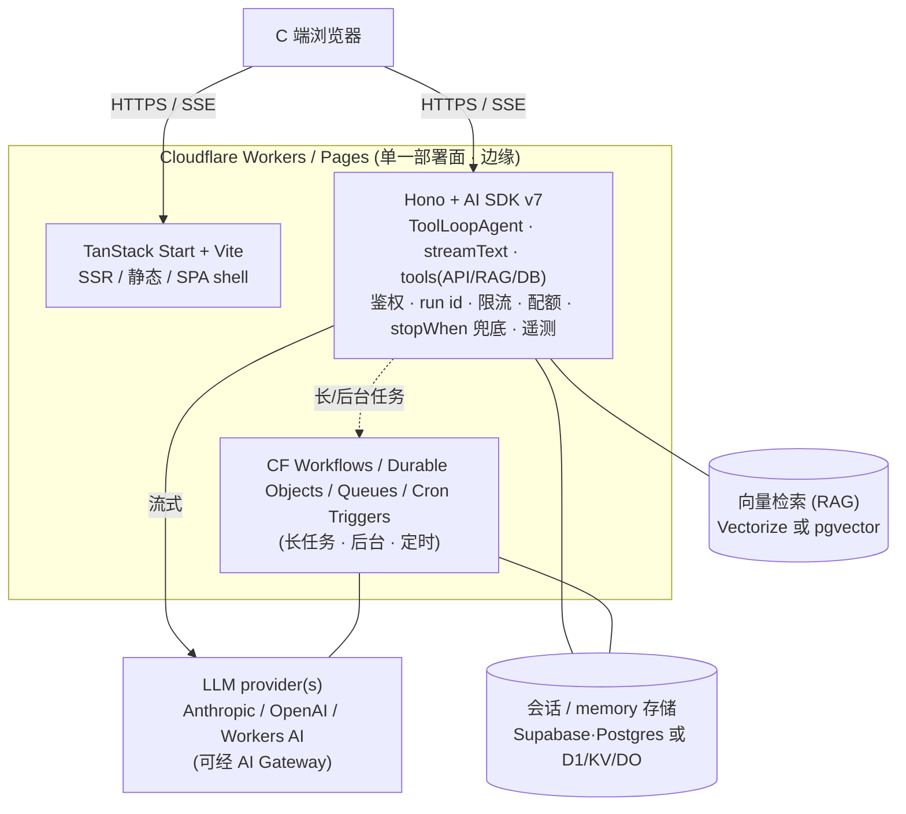

# Agent 运行时与部署架构:AI SDK v7 on Cloudflare(研究简报)

> **Status**: **Decided** — agent 层 = Vercel AI SDK v7 + Hono on Cloudflare Workers(无沙箱、不采用 fastclaw)。待 GPT Pro 做**实现层** deep research。
> **Last Updated**: 2026-06-20
> **Owner**: Planner
> **用途**: ① 作为 GPT Pro deep research 的自包含输入简报;② AiphaBee agent 层架构选型的决策记录 + 事实底稿。
> **读者**: 不依赖任何对话上下文即可读懂。技术名词与路径保留英文原文。

---

## 0. 结论(已定)

- **决策**: agent 层 = **Vercel AI SDK v7(TypeScript 库) + Hono**,跑在 **Cloudflare Workers**,与 TanStack Start + Vite **同栈同仓**,全程边缘。
- **判定依据**: AiphaBee 的 agent **不需要为用户隔离执行不可信代码**(用户 2026-06-20 确认"不要")。工具 = 自有 API / RAG / DB 查询,不需要沙箱。
- **因此 fastclaw 不采用**: 它的核心价值在"沙箱代码执行 + 多租户 agent 平台",本产品用不上;且它是 Go 长驻服务、必须 VPS、并发单位是每会话一个容器(贵)。§3 的 fastclaw 底稿保留为"已评估、已排除"的尽调记录。
- **数据 / 会话 / memory** 落托管存储(Supabase/Postgres 或 Cloudflare 原生 D1/KV/Durable Objects;§5 Q2 决),**不再有 VPS agent 层**。
- 本简报随之从"选型"转为"**AI SDK v7 + Hono on Workers 怎么落地落好**"的实现层 research 输入(见 §5)。

---

## 1. 背景与最初问题(已收敛)

- **产品**: AiphaBee,面向 C 端、预期**高并发**的 AI agent 产品。
- **既定 web stack**: TanStack Start + Vite + Hono。
- **最初的开放问题**: agent 层怎么放?高并发 C 端是否/能否让 agent 也走 Cloudflare?候选 = fastclaw vs Vercel AI SDK v7。
- **收敛结果(§0)**: 因无沙箱代码执行需求,选 AI SDK v7 + Hono on Workers,排除 fastclaw。

---

## 2. 架构(已定拓扑)

**没有 VPS、没有独立 agent origin、没有沙箱容器层。** 计算在 Workers 边缘,状态在托管数据服务。

**边界职责**

| 层 | 跑在哪 | 负责 |
|----|--------|------|
| Web | CF Workers/Pages | TanStack Start SSR、静态、C 端 web 并发、就近、DDoS |
| Agent 编排 | CF Workers(Hono + AI SDK v7) | agent loop、tool calling(API/RAG/DB)、流式、鉴权、run id、限流、配额、`stopWhen` 兜底、遥测 |
| 长/后台任务 | CF Workflows / Durable Objects / Queues / Cron | 超出单请求的多步循环、定时/自主行为(替代 fastclaw 的 cron) |
| 状态 | Supabase/Postgres 或 D1/KV/DO | 会话历史、agent memory、用户/多租户数据 |
| 检索 | Vectorize 或 pgvector | RAG 向量库 |

---

## 3. fastclaw 事实底稿(已评估,已排除 — 保留为尽调记录)

> **决策结果:不采用。** 理由见 §0(本产品无"用户驱动的沙箱代码执行"需求,而那是 fastclaw 的核心价值)。以下保留为 why-not 的证据;**若未来产品出现"让用户的 agent 隔离跑任意代码/shell"的需求,回看本节**——届时 fastclaw 可作为一个被 Hono+AI SDK 当 tool 调用的沙箱后端候选(与 E2B / Cloudflare Sandbox 比较)。

| 维度 | 结论 | 证据 |
|------|------|------|
| 性质 | 自托管 "Agent Factory":创建/存储/运行 AI agent,每个带 `SOUL.md` 人格、`MEMORY.md` 记忆、skills、工具 | `README.md` |
| 语言/运行时 | Go `1.25`,`CGO_ENABLED=0` 单静态二进制;stdlib `net/http`;Next.js 16 dashboard 静态导出后**嵌进二进制** | `go.mod`、`Dockerfile`、`internal/gateway/gateway.go` |
| 进程模型 | 长驻 gateway daemon;派生宿主 `sh -c` shell、每 session 一个 Docker 沙箱容器、子进程 MCP/插件、常驻 cron/heartbeat/queue ticker、内存态 pub/sub + SSE、内嵌 SQLite | `exec.go:195,368`、`sandbox/docker.go`、`cron/scheduler.go`、`taskqueue/queue.go`、`bus/bus.go` |
| 并发模型 | 共享 Go 进程;全局信号量**默认 10**;**per-chat FIFO 串行**;每 session 一个容器/microVM;横向扩 = 多 pod 共享 Postgres+S3 | `taskqueue/queue.go`、`executor.go` |
| 已记录瓶颈 | 上游 LLM 连接卡死会堵住该 chat 队列,**"只有重启 pod 能恢复"** | `internal/provider/provider.go:11-25` |
| 持久化 | 单库为真值源;默认 SQLite,多 pod 切 Postgres;S3 对象存储;无 Redis/KV | `internal/store/database.go`、`go.mod` |
| 部署物 | Dockerfile / Compose / multi-pod / k8s / helm / goreleaser;**无 wrangler/vercel/fly** | `deploy/*`、`.github/workflows/*` |
| **CF Workers 裁决** | **无法上 Workers**(Go 非 JS;且进程派生/常驻/分钟级 CPU/内存态会话/本地 FS 逐条都是 Workers 禁区);**必须 VPS/pods** | 见上各行 |
| 对接面 | 独立 HTTP 服务:OpenAI 兼容 `/v1/chat/completions`(SSE)、`/v1/users` + `X-Fastclaw-End-User` 多租户 | `internal/api`、`README.md` |

---

## 4. 关键架构判断(为什么这个决策省心)

最初判断:高并发 C 端的瓶颈在 agent 层,不在 web 层。**锁定 AI SDK v7 + Workers 后,agent 层的瓶颈结构整个变好了:**

- 并发单位从 fastclaw 的"**每会话一个容器**"(贵、要扩 pod、有卡死重启风险)变成"**一次 Worker 请求**"(便宜、全球、按量、近乎无限横向)。
- 真正的天花板从"沙箱容器成本"收缩为"**LLM provider 速率/费用 + Workers 单请求限制**"——前者本来就躲不掉,后者用 `stopWhen` 兜底 + 长任务下沉到 Workflows/DO 即可。
- 全栈 TypeScript、单一 Cloudflare 部署面,**没有异构 Go 服务和 VPS 运维**。

---

## 4b. 为什么是 AI SDK v7 而不是 fastclaw(决策依据)

**关键认知:两者不是同一类东西。**

- **fastclaw = 平台 / 产品**(运行中的 Go 服务):多租户、memory、skills、沙箱执行、cron、IM 全包。
- **AI SDK v7 = TypeScript 库**:你自己写 agent loop,它给 provider 抽象、流式、多步 tool-calling、UI hooks、agent 原语;沙箱/记忆库/多租户用你自己的 DB + auth 拼。

**AI SDK v7 经核实的关键事实**(来源:Context7,v7 文档站 `ai-sdk.dev/v7`):

- **跑在 Cloudflare Workers**:官方 `workers-ai-provider` + `fetch` handler + `streamText` / `createTextStreamResponse` 边缘流式(`/v7/providers/community-providers/cloudflare-workers-ai`)。
- **Hono 一等支持**:cookbook 直给 Hono + `createUIMessageStreamResponse` + `toUIMessageStream`(`/v7/cookbook/api-servers/hono`)。
- **agent 原语**:`ToolLoopAgent`、`agent.stream()`、`stopWhen`(`isStepCount` / `isLoopFinished`,默认 20 步)、`prepareStep`、结构化输出(`Output.object`)、per-call telemetry;另有持久化用的 `WorkflowAgent`。
- provider 无关(Anthropic / OpenAI / Workers AI / …),纯 `Request`/`Response`/Web-Streams,边缘原生。

**对 AiphaBee 的取舍(决定选 AI SDK v7 的原因):**

| 维度 | fastclaw(平台) | **AI SDK v7(库)← 选中** |
|------|----------------|--------------------------|
| 语言 | Go(异栈) | TypeScript(与 web 同栈同仓) |
| 部署 | VPS/pods + Postgres + S3 + 沙箱 | **CF Workers 边缘** |
| 并发单位 | 每 session 一个容器(贵) | Worker 请求(便宜、全球、高并发) |
| 内置能力 | 多租户/memory/skills/沙箱/cron 全有 | 仅 loop+流式+tool;其余自建 |
| 沙箱代码执行 | 内置 | 无 → **本产品不需要,故无损失** |
| 控制权/成本 | 受平台约束 | 你拥有 loop,成本/延迟/分层自定 |
| 锁定/运维 | 重(自运维 Go 服务+基建) | 轻(库,无常驻服务) |

> 因为 §0 确认"**不需要沙箱代码执行**",fastclaw 唯一对本产品独有的价值(隔离执行)被划掉,剩下的能力 AI SDK + 自有 DB/auth 都能更轻地覆盖。决策成立。

---

## 5. 给 GPT Pro 的 deep research 问题(实现层,已聚焦)

> 选型已定(§0)。以下问题服务于"**把 AI SDK v7 + Hono on Cloudflare Workers 这套 agent 层落地落好**",不再讨论是否选它。每条希望要:业界现状/常见做法、可选方案对比、对 AiphaBee(高并发 C 端、无沙箱)的具体建议与默认推荐。

1. **AI SDK v7 多步 agent loop 在 CF Workers 的运行边界(最高优先级)**: `ToolLoopAgent` / `streamText` 多步 tool 循环在 Workers 上的 **CPU 时间 / subrequest 数 / 墙钟**实测上限;交互式对话(单 Worker 流式,I/O-bound)与长/自主任务的分界线在哪?长任务该用 **Cloudflare Workflows / Durable Objects / Queues** 哪一个承载,模式如何?SSE / UI message stream 在 Workers 的流式最佳实践与坑。
2. **会话与 memory 存储选型**: 高并发 C 端聊天历史 + agent memory,**Supabase/Postgres vs Cloudflare D1 vs KV vs Durable Objects** 的一致性/延迟/成本/扩展性对比与推荐(注:旧栈用过 Supabase,可作为默认候选评估)。
3. **无沙箱下的工具与 RAG**: tools = 自有 API / DB 查询 / 检索。边缘 RAG 向量库 **Cloudflare Vectorize vs Supabase pgvector vs 其他**;`tool()` 定义、并行工具调用、`experimental_repairToolCall`、结构化输出的生产模式。
4. **多租户隔离 / 限流 / 配额 / 成本护栏**: AI SDK + Workers 上 per-user 隔离、滥用防护、`stopWhen` 兜底防跑飞、单用户/全局预算控制、speculative 滥用与 prompt 注入防护的模式。
5. **LLM provider 策略与成本模型**: 模型选型(Anthropic / OpenAI / Workers AI)、各家速率上限、路由/降级/重试(是否走 **AI Gateway** / OpenRouter)、给定 N 并发 C 端会话 + 平均 turn token 量的**月度成本曲线与扩容拐点**。
6. **可观测性 / eval**: AI SDK v7 telemetry(OpenTelemetry)+ tracing 在 Workers 的接法;C 端 agent 的 eval、回归、线上质量监控方案。
7. **长任务 / 定时 / 自主行为**: 没有 fastclaw 的 cron,用 **CF Cron Triggers + Workflows/Queues** 实现定时 / 后台 / 多步自主 agent 行为的模式与限制。

---

## 6. repo-harness 映射

- 整个产品收敛为 **Plan C(TanStack Start + Vite + Cloudflare Workers) + Plan E(Cloudflare 边缘)**:**单一 Cloudflare 部署面,无独立 VPS agent sidecar**。`/` 保持 SSR/prerender,`/app` client-only。
- **Hono = app-facing agent gateway**(repo-harness 默认的网关角色:auth/policy/run id/工具契约/流式/遥测),**AI SDK v7 在其内做 agent 编排**。
- 数据层:Supabase/Postgres 或 Cloudflare 原生(D1/KV/DO),待 §5 Q2 定。
- 不引入 Go sidecar(Plan H)、不引入沙箱运行时——除非未来出现沙箱代码执行需求(回看 §3)。

---

## 7. 证据地图 / 来源

**AI SDK v7**(来源:Context7,`/websites/ai-sdk_dev_v7`,文档站 `ai-sdk.dev/v7`):
- `/v7/providers/community-providers/cloudflare-workers-ai` → `workers-ai-provider`、Workers `fetch` handler + `streamText` 边缘流式。
- `/v7/cookbook/api-servers/hono` → Hono + `createUIMessageStreamResponse` + `toUIMessageStream`。
- `/v7/docs/agents/building-agents`、`/v7/docs/reference/ai-sdk-workflow/workflow-agent`、`/v7/docs/reference/ai-sdk-core/loop-finished` → `ToolLoopAgent` / `WorkflowAgent` / `agent.stream()` / `stopWhen` / `isStepCount` / `isLoopFinished`。
- 版本现状:v5 / v6 / v7 文档站并存,v7 为当前线。

**fastclaw**(来源:`github.com/Ancienttwo/fastclaw` public,branch `dev`,2026-06-18 代码实证):
- `README.md` → "Agent Factory" 定义、API、多租户、multi-pod/K8s 部署。
- `go.mod` / `Dockerfile` → Go 1.25 单二进制、纯 Go SQLite、Postgres、S3;**无官方 Anthropic SDK**(provider 为手写 HTTP/SSE)。
- `internal/agent/tools/exec.go:195,368`、`bash_session.go` → 宿主 `sh -c`、持久后台 shell。
- `internal/sandbox/docker.go`、`executor.go`、`boxlite_executor.go` → Docker 子进程 + E2B/Boxlite 沙箱,per-session 容器。
- `internal/cron/scheduler.go`、`heartbeat.go`、`taskqueue/queue.go`、`bus/bus.go` → 常驻 ticker、per-chat FIFO、全局信号量(默认 10)、内存态总线。
- `internal/provider/provider.go:11-25` → "重启 pod 才恢复"事故注释。
- `deploy/{docker,multi-pod,k8s,helm}/*` → 部署目标,**无 wrangler/vercel/fly**。
