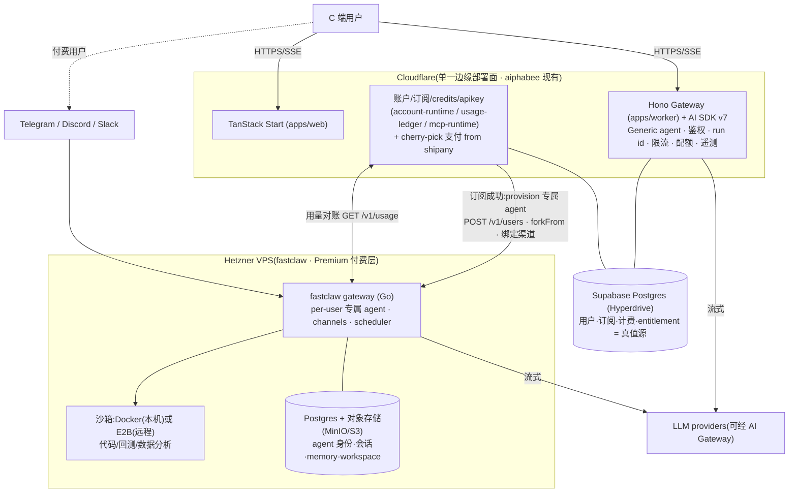

# Premium 付费 Agent 层:fastclaw on Hetzner VPS(架构评估)

> **Status**: **Evaluated — 建议采纳(待 §10 开放决策拍板)**。这是对 `20260620-agent-runtime-fastclaw-cloudflare.md`(下称「6-20 决定」)的**延续,不是推翻**:6-20 决定"agent 层 = AI SDK v7 on Cloudflare、不采用 fastclaw",并预留"若出现隔离执行代码需求则回看 fastclaw";本文即触发该回看后的评估。
> **Last Updated**: 2026-06-23
> **Owner**: Planner
> **用途**: 评估"在 aiphabee 现有 AI-SDK-on-CF 架构之上,引入 fastclaw(部署于 Hetzner VPS)作为**定制付费 Agent 层**"的可行性 / 成本 / 风险 / 工作量,作为决策记录与实施输入。
> **读者**: 不依赖任何对话上下文即可读懂。技术名词与路径保留英文。

---

## 0. 结论先行(Verdict)

采纳**两层 Agent 架构**:

- **Generic 层(保留现状)= AI SDK v7 + Hono on Cloudflare Workers**。网页对话、金融研究助手、工具=自有 API/RAG/DB,无沙箱。即 6-20 决定的方案,原样不动。
- **Premium 付费层(新增)= fastclaw on Hetzner VPS**。承载 CF Workers 干不了的三件事:① IM 渠道 bot(Telegram/Discord/Slack)② 隔离执行代码/回测/数据分析(沙箱)③ 自主/定时任务(盯盘、定时推送)。

这三项**同时是 fastclaw 的独有价值 + CF Workers 的硬禁区**(进程派生/常驻/沙箱/长连接),因此引入 fastclaw 是补齐边缘架构补不了的能力,而非冗余。判定依据:

- ✅ **计费与账户真值源 = aiphabee**(Supabase)。fastclaw README 明确"User accounts, billing → Your app"。订阅成功后由 aiphabee 调 fastclaw admin API,给用户**开通一个 `forkFrom` 模板的专属 agent**。
- ✅ **License 已核(2026-06-23)**:aiphabee 用法(fastclaw 作**纯 API 后端**、终端用户与 aiphabee 交互而非直接与 fastclaw)是 FastClaw Community License **明列的许可用例,无需商业授权**(见 §7)。
- ✅ **shipany 的 cherry-pick 价值真实但非 drop-in**:shipany 有真支付(Stripe/支付宝/PayPal/微信/Creem)/真 auth(better-auth)/credits/subscriptions/apikeys 的 working 实现;但它是 Drizzle + 直接写库 + Bun,aiphabee 是 Supabase 裸 SQL + plan-then-execute 治理 + npm → **作为移植参考,不是依赖**(见 §6)。
- ⚠️ **fastclaw 的并发不是"k8s pod 做并发"**(见 §4):单 VPS 起步并发单位是 goroutine + 每会话一个 Docker 沙箱容器;k8s+HPA 是后期 scale-up,且即便上 k8s 也是**网关层 HPA 扩副本 + E2B 远程沙箱**,而非 pod-per-agent。
- ⚠️ **三个必须正视的风险**(见 §8):并发瓶颈(全局信号量默认 10 + per-chat FIFO + LLM 卡死需重启)、沙箱隔离等级(VPS-Docker vs E2B microVM)、数据双源(billing 在 aiphabee / 会话在 fastclaw)。

---

## 1. 背景与触发条件

- **产品**: aiphabee,面向 C 端的 AI agent 产品(港股研究 / IPO 分析域),TanStack-Start-on-Cloudflare SaaS。
- **现状关键事实(实证)**:
  - aiphabee **不是** shipany 的 fork,是自研:npm monorepo = `apps/web`(TanStack Start)+ `apps/worker`(Hono)+ 27 个 `packages/`;数据层 = Supabase Postgres via Cloudflare Hyperdrive + D1;**无 Drizzle / 无 better-auth / 无 Paraglide**。
  - **已有自研 agent-runtime**:`packages/agent-runtime`(Vercel AI SDK v7 + `@ai-sdk/openai-compatible`,经 Cloudflare AI Gateway),目前 `model_calls_enabled: false` 关着。
  - 商业化原语**已脚手架但未 live**:`packages/account-runtime`(auth/订阅/RBAC)、`packages/usage-ledger`(credits/计费对账)、`packages/mcp-runtime`(API keys)——全是 planner 模式、`planned_no_write`(无真实写库、无支付/auth provider 调用、无前端)。
- **6-20 决定**: agent 层 = AI SDK v7 + Hono on Workers,无沙箱,不采用 fastclaw。理由:当时确认"无需为用户隔离执行不可信代码";fastclaw 是 Go 常驻服务、必须 VPS、每会话一个容器(贵),且有"上游 LLM 卡死堵住该 chat 队列、只能重启 pod 恢复"的事故注释(`internal/provider/provider.go:11-25`)。该文档 §3 预留回看条件。
- **本次触发**: 产品要做**定制付费 Agent**,且明确需要 IM 渠道 bot + 隔离执行代码/回测 + 自主定时任务——正是 6-20 预留的"出现隔离执行需求则回看 fastclaw"的时刻。定位:**现有 AI SDK 方案 = generic 档;fastclaw = 定制付费档,部署在 Hetzner VPS。**

---

## 2. 目标架构拓扑

**边界职责**

| 层 | 跑在哪 | 负责 | 状态 |
|----|--------|------|------|
| Web + Generic agent | CF Workers | 网页对话、AI SDK v7 loop、边缘高并发 | 已有(model calls 待开) |
| 账户/订阅/计费 | CF Workers + Supabase | auth、订阅、credits、apikey、支付回调 | 脚手架已全(`planned_no_write`)+ 需接真支付/真 auth |
| **Premium agent** | **Hetzner VPS(fastclaw)** | per-user 专属 agent、IM channels、沙箱执行、cron 自主任务 | **新增** |
| Premium 状态 | VPS 本地 Postgres + 对象存储 | agent 身份/会话/memory/workspace | 新增 |

---

## 3. fastclaw 事实底稿(实证)

- **性质**: 自托管 "Agent Factory":创建/存储/运行 AI agent,每个带 `SOUL.md` 人格、`MEMORY.md` 记忆、skills、工具(`README.md`)。
- **语言/运行时**: Go,单静态二进制;Next.js dashboard 静态导出后嵌入二进制。
- **存储**: DB 为真值源,默认 SQLite,多 pod 切 Postgres(`FASTCLAW_STORAGE_DSN`);workspace 产物落对象存储(S3/OSS/R2/B2/MinIO,`FASTCLAW_OBJECT_STORE_*`)。
- **沙箱**: 后端 `docker`(本机 docker daemon,带连接池 `internal/sandbox/pool.go`)或 `e2b`(远程 microVM);按会话懒创建、空闲驱逐;每次工具调用后把沙箱侧文件同步回持久存储。
- **多租户/卖 bot 原语**(`README.md` / `internal/api/server.go` 实证):
  - `POST /v1/users` — 第三方 app 为每个终端用户铸稳定 fastclaw user_id,**幂等于 `(api_key, external_id)`**。
  - `type=user` API key + `X-Fastclaw-End-User: <app-user-id>` 头 — 按终端用户懒隔离 sessions/memory/files,无需预注册。
  - `POST /api/users/{id}/agents` 带 **`forkFrom`** — 克隆模板 agent 的 SOUL/IDENTITY/skills/model 默认到该用户命名空间(README 原文:"primary building block for 'user buys a bot' flows")。
  - `agent_quota`(per-user;`-1`=无限,`0`=仅管理员开通)。
  - 渠道绑定 — 每 agent 的 Telegram/Discord/Slack token(保存前校验 `getMe`/`/users/@me`/`auth.test`),session 按 channel+chatID 隔离。
  - `GET /v1/usage`(按 key/agent/kind/时间过滤)+ `GET /v1/quota` / `PUT /v1/quota` — 计量与配额。
- **已记录瓶颈**: 共享 Go 进程;全局信号量默认 10;per-chat FIFO 串行;`internal/provider/provider.go:11-25` 注释"上游 LLM 卡死会堵住该 chat 队列、需重启进程恢复"。
- **部署物**: `deploy/docker`(compose)、`deploy/multi-pod`(2 网关 + 共享 PG + MinIO 冒烟)、`deploy/k8s`(单文件 manifest)、`deploy/helm`(Chart:replicas + HPA + PDB)、goreleaser、docker workflow。**无 wrangler/vercel/fly**(确认其无法上 CF Workers)。
- **官方镜像/上游**: `ghcr.io/fastclaw-ai/fastclaw`(上游 `fastclaw-ai/fastclaw`);`Ancienttwo/fastclaw` 默认分支 `dev`,为其 fork。

---

## 4. 部署(Hetzner)与并发模型 ← 核心问题

**"是不是用 k8s pod 做并发?"——分两阶段,答案不同:**

### 阶段 A:单 VPS 起步(推荐 MVP,最省)
- 部署物:`deploy/docker/docker-compose.yml`(gateway + Postgres + MinIO + Docker 沙箱)。
- **沙箱后端 = `docker`**:VPS 有 docker daemon,可本机起容器跑代码——k8s 上做不到(pod 内无 docker daemon → 那边只能 E2B)。代价:gateway 容器需访问宿主 docker(socket 挂载 / DinD)= 一个安全面。
- **并发单位 = goroutine + 每活跃会话一个 Docker 沙箱容器**(懒创建、空闲驱逐,`internal/sandbox/pool.go`)。**不是 k8s pod。**
- **天花板**: 共享 Go 进程;全局信号量**默认 10** 个并发 agent step;**per-chat FIFO 串行**;LLM 卡死可堵队列、需重启进程恢复。→ 付费产品必须**调高信号量 + provider 超时/熔断 + 健康检查自动重启**。
- **容量规划**: per-user 专属 agent(订阅制)= 每付费用户可能常驻 sessions + 偶发沙箱容器 → 按"并发活跃沙箱数 × 容器内存"估 VPS 规格。

### 阶段 B:scale-up(付费量起来再做)
- 切 fastclaw 自带 **Helm chart**(`deploy/helm/fastclaw`):无状态网关 `replicas` + **HPA(min 2 / max 10 @ 60% CPU)+ PDB**,状态全外置 Postgres + 对象存储,任意 pod 服务任意请求、可 failover(`deploy/multi-pod/README.md` 有验证)。
- **此时"k8s pod 做并发"才成立——但只是网关层 HPA 扩副本**;沙箱因 pod 内无 docker daemon **必须切 E2B(远程 microVM)**。即:网关并发 = pod 副本;每用户算力隔离 = E2B,而非 pod-per-agent。
- Hetzner 路径:单大 VPS → 多 VPS + 托管/自建 Postgres + 对象存储 → 需要时上 k8s(Hetzner Cloud + k3s/托管 k8s)。

> **一句话**:起步在 Hetzner 单 VPS 用 docker-compose + Docker 沙箱(并发=进程内信号量+每会话容器);规模化才上 k8s+HPA+E2B。"k8s pod 做并发"是阶段 B 的网关层,不是起点,也不是 pod-per-agent。

---

## 5. 集成面:aiphabee ↔ fastclaw 开通流程

**开通时序(Premium 订阅成功后)**:
1. aiphabee 支付 webhook → `account-runtime` 写订阅 live(plan=pro/developer)。
2. aiphabee 用一个 **admin key** 调 fastclaw:`POST /v1/users`(external_id = aiphabee user id)→ `POST /api/users/{id}/agents?forkFrom=<模板>` → 设 `agent_quota` →(可选)绑定用户给的 IM token → 启用 sandbox。
3. 把该 agent 的 chat 入口(网页 `/v1/chat/completions` SSE 或 IM 渠道)暴露给用户。
4. 周期任务:拉 `GET /v1/usage` 回写 aiphabee `usage-ledger`;credits/配额超限即在 fastclaw 侧 `PUT /v1/quota` 收紧或停用。

> **概念重叠警告**:两边都有"user / apikey / usage"。务必定死真值源 = **aiphabee 管钱与账户身份,fastclaw 管 agent 与执行计量**,用 webhook + 对账打通,避免双写打架。`external_id` 作唯一关联键。

---

## 6. shipany cherry-pick 移植图

shipany 的 working 实现可作**移植参考**(非依赖,因架构错配:shipany = Drizzle + 直接写库 + Bun;aiphabee = Supabase 裸 SQL + plan-then-execute + npm):

| 能力 | shipany 参考路径 | aiphabee 现状 | 动作 |
|------|------------------|---------------|------|
| 支付 | `apps/api/src/core/payment/{stripe,alipay,paypal,wechat,creem}.ts`、`routes/payment/{checkout,callback,notify/$provider}.ts` | `usage-ledger` 有计费 planner,`provider: not_configured` | 移植 Stripe(+ 所需渠道)进 planner 模式,接真 provider |
| Auth | `core/auth/{index,rbac}.ts`(better-auth) | `account-runtime` 有 session 类型,无 live auth | 选型(见 §10 #2)后接真 auth |
| 订阅 | `modules/subscriptions/service.ts` | `account-runtime` 有完整生命周期 planner,`persistent_writes:false` | live 化写库 + 接 provider |
| Credits | `modules/credits/service.ts`(FIFO/过期/赠送) | `usage-ledger` 有事件 planner,`writeReady:false` | live 化 + 适配 aiphabee 加权 credit 模型 |
| API Keys | `modules/apikeys/service.ts` | `mcp-runtime` 有完整 CRUD planner(`aipb_srv_` 前缀、HMAC、IP 白名单),`api_key_live:false` | "翻 live 写"开关——最接近 drop-in |

---

## 7. License 核查结论(2026-06-23,已核)

`Ancienttwo/fastclaw` 的 `LICENSE` = **FastClaw Community License v1.0 = Apache 2.0 + 附加条款**(© ThinkAny, LLC)。逐条对照本架构:

- **§1(a) 商用**: 允许"作为其他应用的后端服务"商用,**免授权**、无需改源码。
- **§1(b)(i) 多租户限制**: 明列两栏——
  - **许可(无需商业授权)**: "Using FastClaw as a backend to power **Your own SaaS product, where end users interact with Your product rather than FastClaw directly**" ← **正是 aiphabee 用法**。
  - **受限(需商业授权)**: "Hosting FastClaw and selling access to multiple unrelated organizations as a competing Agent platform service" ← 不碰。
- **§1(b)(ii) 前端品牌**: 若向终端用户暴露 **fastclaw 自带 dashboard UI**(`web/public/`、`web/src/`),不得去除其 logo/版权;但"纯 API 后端、不暴露其 UI"明确**不受此限**。
- **§3 商标**: 不得用 "FastClaw" 名称/logo 推广衍生产品(未经书面同意)。

**裁决:aiphabee 用法属许可用例,无需向 ThinkAny 购买商业授权。** 两条护栏(均被架构天然满足):① fastclaw dashboard 仅管理员用、不暴露给终端用户;② 不转售给多个不相关组织当竞品平台。需授权时联系 `support@thinkany.ai`。

---

## 8. 风险 / 成本 / 工作量

| 维度 | 评估 | 缓解 |
|------|------|------|
| **并发可靠性** | 全局信号量默认 10 + per-chat FIFO + "LLM 卡死需重启"。付费 SLA 下是真隐患。 | 调信号量;provider 超时/重试/熔断;健康检查 + 自动重启;关键档位预留容量;上规模切 HPA 多 pod 摊风险。 |
| **沙箱隔离** | VPS-Docker 沙箱挂宿主 docker socket = 强权限面;若执行**用户提供的**回测代码,跨租户隔离弱于 microVM。 | 起步:硬化容器(no host net、资源上限、只读 rootfs、drop caps、按用户隔离 workspace)。代码真不可信/跨租户敏感 → 切 **E2B(microVM)**,即便从 VPS 调用。 |
| **数据双源** | billing/identity 在 aiphabee(Supabase);agent 会话/memory/workspace 在 fastclaw(VPS Postgres+对象存储)。 | 明确边界(§5);GDPR/删除双侧级联;`external_id` 作唯一关联键。 |
| **License** | ✅ 已核(§7):许可用例,无需商业授权。 | 守两护栏:dashboard 不暴露给终端用户;不转售当竞品平台。 |
| **Fork 维护** | `Ancienttwo/fastclaw` 是 upstream fork;tailor-made 必然要改(SOUL/skills/可能改码)。 | 定 fork 同步策略;自建镜像(repo 有 goreleaser + docker workflow);CI 跟 upstream 周期 rebase。 |
| **架构错配(cherry-pick)** | shipany 直接写库 vs aiphabee planner/`planned_no_write`。 | shipany 模块当**实现参考**移植进 planner 模式,不 drop-in 引依赖。 |
| **成本** | Hetzner VPS 便宜;但沙箱容器 + Postgres + 对象存储 + LLM token +(可选)E2B 叠加。 | 单 VPS MVP 验证 unit economics;按"并发活跃沙箱"估容量;LLM 走 AI Gateway 统一限流/降级。 |

**工作量量级(粗估)**: Premium 接入(fastclaw 部署 + 开通/对账)= **中**(部署现成,主工作在 aiphabee 侧写 provisioning + 对账 + 订阅 live 化);计费 live 化(cherry-pick 支付 + auth)= **中-大**;tailor-made agent 本体(SOUL/skills/工具)= **小-中**。

---

## 9. 推荐落地路径(分阶段)

- **P0 决策确认**: ✅ License 已核(§7);定沙箱隔离等级(§10 #1);定 fork 同步策略(§10 #3)。
- **P1 fastclaw MVP(Hetzner 单 VPS)**: `docker-compose` 起 gateway+PG+MinIO+Docker 沙箱;建模板 agent(SOUL/skills);跑通 `deploy/multi-pod/README.md` 冒烟(建 agent / 绑定 / 沙箱执行 / usage)。
- **P2 aiphabee↔fastclaw 开通打通**: `apps/worker` 加 admin client 调 `/v1/users` + `forkFrom` + 渠道绑定;`/v1/usage` 对账回写 `usage-ledger`。先用测试订阅手动触发。
- **P3 计费 live 化(cherry-pick)**: 从 shipany 移植 Stripe(+ 所需渠道)checkout/webhook 进 aiphabee planner 模式;接真 auth;`account-runtime`/`usage-ledger`/`mcp-runtime` 翻 live write。支付成功 → 自动触发 P2 开通。
- **P4 加固 + 规模化**: provider 超时/熔断/自动重启;沙箱硬化或切 E2B;付费量起来再上 Helm/HPA。

---

## 10. 开放决策(需拍板,带推荐)

1. **沙箱隔离**: Docker-on-VPS(便宜、隔离弱、运维在你)vs E2B(强隔离、按量付费、外部依赖)。**推荐:起步 Docker-on-VPS + 硬化;回测代码若"用户可注入任意逻辑"则直接上 E2B。**
2. **真 auth 选型**: better-auth(从 shipany 抄)vs Supabase Auth(DB 已在 Supabase,天然集成)。**推荐:Supabase Auth(少一个移植面、同源);支付仍从 shipany 抄 Stripe。**
3. **fastclaw 关系**: 软 fork(跟 upstream 同步)vs 深度硬 fork。**推荐:软 fork + 自建镜像 + 周期 rebase,定制集中在 agent 配置/skills 而非核心码。**
4. **Generic→Premium 升级动线**: 网页内升级即开通 vs premium 独立入口。**推荐:网页内升级,订阅成功静默 provision,用户无感拿到带 channels/sandbox 的增强 agent。**

---

## 11. 验证方式(每阶段如何证明可用)

- **P1**: `docker compose -f deploy/multi-pod/docker-compose.yaml up`(或单 pod compose),按 `deploy/multi-pod/README.md` 跑 curl 清单:建 agent → 绑定 → `FASTCLAW_SANDBOX_BACKEND=docker` 触发一次代码执行 → `GET /api/admin/usage` 见计量行。
- **P2**: aiphabee 集成测试:mock 订阅事件 → 断言 fastclaw `POST /v1/users` 幂等、`forkFrom` 生成专属 agent、`X-Fastclaw-End-User` 隔离生效(A 读不到 B 的 session,期望 403)、`/v1/usage` 拉回并写入 `usage-ledger`。
- **P3**: Stripe test mode 跑 checkout → webhook → aiphabee 订阅 live write → 自动触发 P2 开通;断言端到端"付钱即得 agent"。
- **P4**: provider 故意超时验证熔断不堵队列;沙箱逃逸/资源耗尽红队测试;(规模化)Helm 部署跑 multi-pod failover。

---

## 12. 证据地图 / 来源(2026-06-23 核实)

- **aiphabee 现状**: `packages/agent-runtime/src/index.ts`(AI SDK v7,~256KB,model calls 关)、`packages/account-runtime`、`packages/usage-ledger`、`packages/mcp-runtime`(均 planner/`planned_no_write`)、`apps/worker/src/index.ts`(Hono)、`supabase/migrations/`(63 个)、`deploy/cloudflare/bindings.contract.json`。
- **既有决定**: `docs/researches/20260620-agent-runtime-fastclaw-cloudflare.md`(§0 不采用 fastclaw;§3 回看条件)。
- **fastclaw**(`Ancienttwo/fastclaw`,branch `dev`): `README.md`(`/v1/users`、`forkFrom`、`X-Fastclaw-End-User`、apikey tiers、sandbox docker/e2b)、`internal/api/server.go`(`/v1/*` 路由)、`deploy/{docker,multi-pod,k8s,helm}/`(并发与部署)、`internal/sandbox/pool.go`、`internal/provider/provider.go:11-25`(卡死注释)、`LICENSE`(FastClaw Community License = Apache 2.0 + 多租户/品牌附加条款)。
- **shipany**(`Ancienttwo/shipany-tanstack`,branch `main`): `apps/api/src/core/payment/{stripe,alipay,paypal,wechat,creem}.ts`、`core/auth/{index,rbac}.ts`、`modules/{credits,subscriptions,apikeys,invite-codes}/service.ts`、`routes/payment/{checkout,callback,notify/$provider}.ts`;部署 = 单 Docker 容器 或 Cloudflare Workers(`deploy-cloudflare` skill,D1/Hyperdrive),**无 k8s**。
