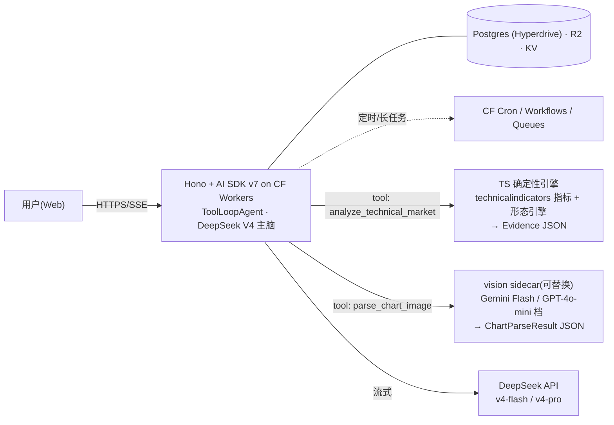

# 双模式投资 Agent:平台收敛与 K 线读取路线(决策记录)

> **Status**: **Decided** — generic 层留 Cloudflare Workers、主脑换 DeepSeek V4;个人专属层 = fastclaw 二开 on VPS;**EdgeOne 与腾讯系服务全线移出方案**。
> **Last Updated**: 2026-07-02
> **Owner**: Planner
> **上承**: `20260620-agent-runtime-fastclaw-cloudflare.md`(generic = AI SDK v7 on CF,不变)、`20260623-fastclaw-premium-tier.md`(fastclaw on Hetzner VPS,宿主结论不变,模型策略在本文更新)。
> **读者**: 不依赖对话上下文即可读懂。技术名词保留英文。

---

## 0. 结论(已定)

| # | 决策 | 依据 |
|---|------|------|
| 1 | **EdgeOne 移除**。generic 不迁、fastclaw 不上、spike 取消 | 用户确认不做大陆部署 → EdgeOne 唯一重磅收益(备案后大陆直连)归零;fastclaw(Go 常驻 daemon)与 EdgeOne 全部三种 FaaS 计算形态结构性冲突;EdgeOne 缺 cron/队列/关系型 DB(§2) |
| 2 | **generic 层不需要 Node 环境,CF Workers 足够** | AI SDK v7 + Hono 纯 Web 标准,workerd 原生;`technicalindicators`/`indicatorts` 纯 JS 无原生模块;"Node ≥22" 约束只管真实 Node 进程形态,不管 Workers;定时/长任务 CF Cron+Workflows+Queues 覆盖 |
| 3 | **主脑 = DeepSeek V4**(`deepseek-v4-flash` 日常 / `deepseek-v4-pro` 复杂推理),经 `@ai-sdk/deepseek` 或 openai-compatible + AI Gateway 接入 | 用户指定;$0.14/$0.28(flash)、$0.435/$0.87(pro)每百万 token;V3.2 起 tool-use 与 thinking 集成。注意 `deepseek-chat`/`deepseek-reasoner` 旧名 **2026-07-24 弃用** |
| 4 | **DeepSeek 官方 API 今日无图片输入**(2026-07-02 对官方 API reference 核实:user content 为 string-only,无 `image_url` content part;V4 vision 仅在官方 App/Web) | → 读图能力由**可替换的 vision sidecar 模型**承担(§3 通道 B);DeepSeek V4 vision API 上线后改一处模型配置即可切换 |
| 5 | **K 线读取 = 三通道分层**:数据通道(主)/ 截图通道(辅)/ 文本渲染(可选提示,非数据通道) | §3。与 TA PRD 既定决策(确定性引擎计算、LLM 解释)一致 |
| 6 | **个人专属层 = fastclaw 二开 on Hetzner VPS**(6-23 方案原样),二开清单新增**视觉解析工具** | fastclaw openai-compatible provider 有 DeepSeek `reasoning_content` 特判(上游一等公民);但每 agent 绑单一主模型,主模型 DeepSeek 无 vision → 用户发图不可读,需 tool 内调 vision sidecar 补齐 |
| 7 | **腾讯系服务全部退出**:混元(用户否决)、SCF(Node 上限 20.19,阻断 AI SDK v7)、Lighthouse(无大陆需求后无必要)、ADP(低代码订阅制平行体系) | 2026-07-02 调研,证据见 §5 |

---

## 1. 为什么 EdgeOne 出局(裁决摘要)

- **fastclaw 不可部署**:EdgeOne 三种计算形态(Edge Functions = V8 isolate / Cloud·Node Functions = 请求触发上限 10–120s / Agent Functions = 单请求生命周期)全是 FaaS;产品目录无容器/VM 托管。fastclaw 需要:进程内 cron ticker、IM 渠道**出站**长连接(Telegram 长轮询、飞书 WS)、进程内会话与沙箱池、本地 SQLite。四条均与 FaaS 冲突。控制台"支持 Go 部署"= 支持 Go 写的请求处理函数(Gin/Echo/Fiber 模板),不是托管 Go daemon。
- **generic 不需要迁**:EdgeOne 相对 CF 的实质优势只有备案后大陆直连;不做大陆部署则只剩劣势(无 cron 触发器、无队列、KV 仅 1GB 且只绑 Edge Functions、无 D1 级数据库、免费额度无公开数字、AI SDK v7 组合无人验证)。

## 2. generic 层最终形态(不动 + 换脑)



- 主脑与 vision 走不同 provider 是 AI SDK 的常态用法(per-tool/per-call 模型自由);全部经 Cloudflare AI Gateway 统一限流、观测、降级。
- 前端画图 = generative UI:工具返回 OHLCV+指标 JSON,客户端 lightweight-charts 渲染。模型不产像素。

## 3. K 线图 → DeepSeek 的三条通道(本次核心问题)

### 通道 A(主):结构化数据,不存在"读图"问题

系统有 OHLCV(BYO Data API / 数据合作方)时,模型**从头到尾不需要看图**:

```text
OHLCV → TS 指标引擎(RSI/MACD/BB/ATR/ADX…精确值)
      → 形态引擎(swing 结构、双顶/背离,candidate/confirmed 状态机)
      → Evidence JSON → DeepSeek 只做解读与情景叙述
```

这是 TA PRD 的既定决策,也是唯一可托底读数精度的路径。给 DeepSeek 的正确"图形替代物"是**符号化市场结构文本**,例如:

```text
swings: HH 105.2(05-12) → HL 98.4(05-20) → HH 109.9(06-02) → LH 107.1(06-18)
RSI(14)=68.3 rising; MACD hist +0.42 expanding; close vs BB: upper-band ride
pattern: double_top candidate (neckline 98.4, invalidation > 110.2)
```

信息对分析无损、token 极省、可审计——这本来就是 FR-09/FR-10 引擎的输出。

### 通道 B(辅):用户上传截图 → vision sidecar 解析,DeepSeek 不碰像素

输入是像素时必须有模型读像素,绕不开。但它的角色是**解析器而非分析师**:输出严格 `ChartParseResult` JSON(symbol/timeframe/可见指标/画线/形态候选+置信度),之后全部交 DeepSeek。候选(均为公网 API,Workers 可调):

| 选项 | 定位 | 备注 |
|------|------|------|
| Gemini Flash(-Lite) 档 | **默认推荐** | 图表理解强、便宜(单图约 $0.001 量级)、快 |
| GPT-4o-mini / GPT-5-mini 档 | 备选 | 同档价格,imageDetail 可调 |
| Claude Haiku 4.5 | 备选/交叉验证 | 与评测口径互补 |
| Qwen3-VL / Qwen2.5-VL(开源权重,OpenRouter 等托管) | 开源最强图表/OCR 系 | 无需国内账号 |
| DeepSeek-VL2 / DeepSeek-OCR(开源自托管) | 血统统一 | 需 GPU 推理面,MVP 不建议 |
| DeepSeek V4 vision **API**(未上线) | 终局切换目标 | App 已有,API schema 未开;上线后改模型名即可 |

vision 读数精度有系统性局限(arXiv 2604.12659:VLM 在震荡行情读 K 线能力弱),因此 sidecar 输出的数值只作路由与候选,**不进最终结论**——与 PRD FR-01 的置信度路由一致。

### 通道 C(可选):ASCII / 文本渲染图 —— 不能作为数据通道

对"用 ASCII 图形代替"的直接回答:**当形状提示可以,当数据通道不行**。硬伤:

1. **分辨率量化**:字符网格(如 120×30)把价格轴压成 ~30 档,<1% 的价差直接不可见;300–500 根 K 线(形态检测所需 lookback)在横轴上塌缩。
2. **LLM 空间推理不可靠**:对 ASCII 里"哪根高点更高"这类判断误差率高,不如把 swing 点直接给成数字(通道 A 已做)。
3. **token 不划算**:多面板(价格+量+RSI)线性放大;同样的 token 花在 Evidence JSON 上信息密度高一个量级。

结论:ASCII 最多作为回答里的装饰性 sparkline;模型侧的"图形理解"需求已被 通道 A 的符号化结构 + 通道 B 的 sidecar 完整覆盖。

### 视频模型:不需要

K 线截图是静态图,视频模型(video-understanding 系)对本需求零增益;除非未来做"看盘录屏解读",不在范围内。

## 4. 个人专属层(fastclaw)更新

- 宿主:Hetzner VPS,docker-compose 起步(6-23 §4 阶段 A 原样);沙箱可选本机 Docker 或 E2B/Boxlite 远程(上游新增,宿主不再必须有 Docker daemon)。
- 模型:DeepSeek V4 经 fastclaw `internal/provider/openai.go`(通用 OpenAI-compatible,`apiBase` 可配,含 `reasoning_content` 特判)。
- **二开清单新增**:视觉解析工具(用户经 Telegram 等发图 → tool 内调与 generic 同一个 vision sidecar 端点 → 结构化结果回主模型)。fastclaw 每 agent 绑单一主模型,不加这个 tool 则 DeepSeek 主模型下"发图解读"落空。
- 抓取:上游自带 `web_fetch`/`web_search`(direct/Firecrawl/Jina)+ camoufox 反检测浏览器,满足"网页抓取"需求,无需自研。

## 5. 证据地图(2026-07-02 调研)

- DeepSeek:官方 API reference(`api-docs.deepseek.com/api/create-chat-completion`,content string-only;模型 `deepseek-v4-flash`/`deepseek-v4-pro`)、pricing 页;NVIDIA NIM `deepseek-v4-pro` 标注 text-only。V4 vision 仅 App/Web,第三方"API 已支持"说法与官方 schema 矛盾,不采信。
- EdgeOne:`edgeone` CLI 1.6.10 本机实证(`pages`→`makers` 弃用迁移、`init --agent-framework` 支持 claude-agent-sdk 等);Cloud Functions maxDuration 10–120s(edgeone.json 参考);产品目录无容器托管;无 cron 字段(verified-negative)。
- fastclaw 上游(`fastclaw-ai/fastclaw` dev,v0.47.0,30 天 79 commits):Go 1.25 daemon、`internal/cron/scheduler.go`、channels 出站长连接、沙箱 backend docker/e2b/boxlite、License 仍为 FastClaw Community License v1.0(纯 API 后端用法免商业授权)。
- AI SDK v7:多模态 file part 全路径支持(generateText/streamText/ToolLoopAgent);`@ai-sdk/openai-compatible` 将 image part 序列化为标准 `image_url`(vercel/ai 源码);**Node ≥22 / ESM-only** 仅约束真实 Node 进程部署形态;腾讯 SCF 运行时上限 Node 20.19 → 排除。
- vision 读 K 线局限:arXiv 2604.12659(多尺度 K 线 benchmark,震荡行情能力弱)、arXiv 2509.17481(图表幻觉评测)。
- 待办注记:TA PRD(`plans/prds/20260624-stock-technical-analysis-agent-prd.md`)§12.1 推荐栈(Python+FastAPI+TimescaleDB+TA-Lib)与仓库 TS-on-Workers 基线冲突,落地前需修订为 TS 指标引擎方案。

## 6. 落地顺序

1. **P0**:`packages/agent-runtime` 挂 TS 确定性指标 tool(`technicalindicators`),fixture 交叉校验(对 `indicatorts` 断言 RSI/MACD/BB 一致)——TA PRD Phase 0 第一项。
2. **P1**:形态引擎(swing/双顶/背离状态机)+ Evidence JSON 契约;DeepSeek 主脑接入(AI Gateway 加 deepseek 路由,7-24 前确认无旧模型名)。
3. **P2**:`parse_chart_image` vision sidecar tool + 置信度路由(FR-01);generative UI 图表渲染。
4. **P3**:fastclaw VPS MVP(6-23 P1–P2)+ 视觉工具二开。
